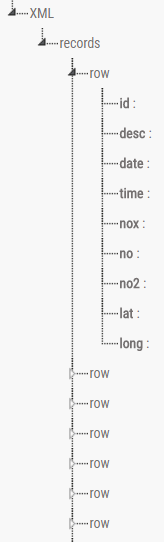

# Web ADVANCED TOPICS IN WEB DEVELOPMENT
Document Object Model (DOM) parsers and Streaming API for XML(StAX))parsers are two programming models use to get and create XML infoset.

### DOM parsers
DOM parsers is also known as a tree parsers, it loads entire xml document as tree structure into the memory. Once data is in the memory, it provides random access to the data by tag name. It works well with small xml, but when the size of xml document increases, the greater the chance of a memory problem. SimpleXML() is an extension of DOM parsers and allows easy access to the XML data. Although it performs as a tree search, it is slow when accessing a list of children (unbalanced tree). 

### Streaming parsers
Streaming is like the conveyor belt, reads and writes data sequentially. It is not good to use when complex xml structures need to be changed, as multiple passes are required. This is due to data being processed sequentially - if a change is requested at the top and the stream is near the bottom/middle, the stream will need to make another pass through the document.
An example benefit of using streams is that it is easier and faster to access elements of the same name - e.g. in the PHP code this method was performed: `reader->next("row")` to access a list of "rows".

### Why use Streaming parsers instead of DOM parsers
Firstly, although using DOM parsers can make the data access easier, it is not suitable to use in this project when creating the massive no2 files. As the mention before, DOM will store entire XML into the memory, the XML document for this project is seems too big for DOM, which it will cause the memory overflow. Compare with DOM, Streaming parsers only store tiny amount of data in the memory.

If memory was not a concern, DOM parsers would still need traverse the whole tree to retrieve each `row`, whereas stream parsers can get next `row` easier as mentioned above. This can largely decrease the processing time.

However, XMLReader and simpleXML sometimes can use together, use the Streaming parsers to read the XML document, then convert part of element into DOM to access the data. This can take the benefits from both DOM and Streaming parsers which can get data easier and faster without any memory problems plus improves code readability.

###  Extending the visualisation
Scatter Chart
- User input selection
  - Location
  - Year
  - Time
- Colour for different level of no2

Line Chart
- Custom Tooltip to display date, time and no2 value
- Colour for different level of no2

Map Chart

Pie Chart

Bar Chart

### Reference
https://msdn.microsoft.com/en-us/library/system.xml.xmlreader(v=vs.110).aspx
http://php.net/manual/en/intro.simplexml.php
